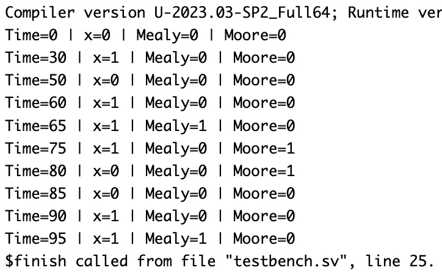

# "1101" Sequence Detector (Mealy and Moore FSM) – Verilog

## 🧠 Project Overview

This project implements a **“1101” sequence detector** using both **Mealy** and **Moore** finite state machines (FSMs).  
The design detects the bit sequence `1101` in a serial input stream.  
Both versions are synchronous and use a clocked **D Flip-Flop (DFF)** for state memory.

---

## ✅ Key Features

- **Two FSM Types Implemented:**
  - **Mealy Machine:** Output depends on **current state and input**
  - **Moore Machine:** Output depends **only on the current state**
- **Overlapping Sequence Detection:** Detects overlapping `1101` patterns
- **Inputs:**
  - `x` – Serial input bit
  - `clk` – Clock input
  - `reset` – Asynchronous reset
- **Outputs:**
  - `y_mealy` – Output of Mealy FSM
  - `y_moore` – Output of Moore FSM

---

## 📂 Files Included

- `dff.v` – D Flip-Flop design file  
- `mealymoore1101.v` – Contains both Mealy and Moore FSMs  
- `mealymoore1101_tb.v` – Testbench for both FSMs  
- `fsm_1101_waveform.png` – Waveform screenshot  
- `README.md` – Documentation file  

---

## ⚙️ How It Works

### 🔹 Mealy FSM

- The output `y` becomes `1` **during the transition** when the sequence `1101` is detected.  
- Faster detection (since output reacts within the same clock cycle).  
- Uses **4 states (S0–S3)** and transitions based on input `x`.

### 🔹 Moore FSM

- The output `y` becomes `1` **after reaching the final state** for `1101`.  
- Slightly delayed output but easier to design.  
- Uses **5 states (S0–S4)** with the output assigned to state `S4`.

---

## 📊 Testbench Simulation Output

From `mealymoore1101_tb.v` — for the input pattern `"0011011101"`:

| Time (ns) | x | Mealy Output | Moore Output | Comments |
|------------|---|---------------|---------------|-----------|
| 0 | 0 | 0 | 0 | Reset |
| 10 | 0 | 0 | 0 | Idle |
| 20 | 1 | 0 | 0 | Start detecting (1) |
| 30 | 1 | 0 | 0 | Sequence "11" |
| 40 | 0 | 0 | 0 | Sequence "110" |
| 50 | 1 | 1 | 0 | ✅ Mealy detects "1101" immediately |
| 60 | 1 | 0 | 1 | ✅ Moore output high (delayed) |
| 70 | 0 | 0 | 0 | Idle |
| 80 | 1 | 0 | 0 | New sequence start |
| 90 | - | - | - | End of simulation |

- **Mealy FSM** gives output `1` at **time = 50 ns** (on transition).  
- **Moore FSM** gives output `1` at **time = 60 ns** (on reaching final state).

---

## 🖼 Waveform

---

## 🛠 Tools Used

- **Verilog HDL** – FSM design  
- **Verdi** – Waveform visualization (`$fsdbDumpvars`)  
- **VCS** – Simulation  

---

> 💡 This project demonstrates how **Mealy and Moore FSMs** differ in timing and implementation for the same sequence detection logic.  
> These FSMs are fundamental in **digital control circuits, pattern detectors, and serial communication systems**.
