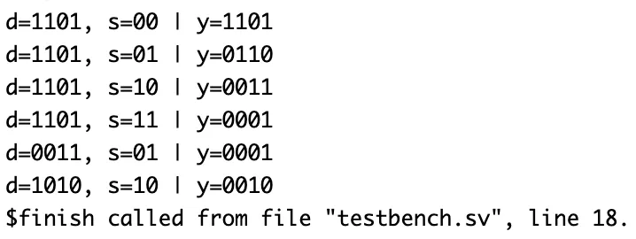

# 4-bit Barrel Shifter – Verilog

## 🧠 Project Overview

This project implements a **4-bit Barrel Shifter** using **2x1 multiplexers** in Verilog.  
A barrel shifter allows **multi-bit shifting in one clock cycle** without sequential shifting.  
The design supports **right shifting** by 0, 1, 2, or 3 positions, controlled by a 2-bit select input (`s`).

---

## ✅ Key Features

- **Functionality**: Shifts a 4-bit input (`d`) right by 0–3 positions.
- **Design Style**: Structural modeling using hierarchical **2x1 MUX** modules.
- **Inputs**:
  - `d[3:0]` – 4-bit data input
  - `s[1:0]` – Shift control (`00`=no shift, `01`=1-bit, `10`=2-bit, `11`=3-bit)
- **Output**:
  - `y[3:0]` – Shifted output

---

## 📂 Files Included

- `mux2.v` – 2x1 Multiplexer module  
- `barrel_shifter_4bit.v` – 4-bit Barrel Shifter design  
- `barrel_shifter_4bit_tb.v` – Testbench for Barrel Shifter  
- `barrel_shifter_waveform.fsdb` – Waveform dump file (Verdi)  
- `barrel_shifter_waveform.png` – Simulation waveform screenshot  
- `README.md` – Documentation for this module  

---

## ⚙️ How It Works

The design performs the shifting in **two stages** using multiplexers:

1. **Stage 1** – Uses `s[0]` to shift by 1 bit.  
2. **Stage 2** – Uses `s[1]` to shift by 2 bits.  

The combination of both stages allows **any 0–3 bit right shift** in a single operation.

Equation (conceptually):y = d >> s
Each bit of the output `y` is selected using a network of 2x1 MUXes that route appropriate input bits or zeros for shifted positions.

---

## 📊 Testbench Simulation Output

From `barrel_shifter_4bit_tb.v`:

| Input `d` | Shift `s` | Output `y` | Description |
|------------|-----------|------------|--------------|
| 1101 | 00 | 1101 | No shift |
| 1101 | 01 | 0110 | Shift right by 1 |
| 1101 | 10 | 0011 | Shift right by 2 |
| 1101 | 11 | 0001 | Shift right by 3 |
| 0011 | 01 | 0001 | Shift right by 1 |
| 1010 | 10 | 0010 | Shift right by 2 |

---

## 🖼 Waveform

---

## 🛠 Tools Used

- **Verilog** – RTL and structural modeling  
- **Verdi** – Waveform visualization (`$fsdbDumpvars`)  
- **VCS** – Simulation  

---

> 💡 The **barrel shifter** is widely used in processors and ALUs for fast bit manipulation.  
> This project demonstrates how hierarchical Verilog design (building from multiplexers) can efficiently realize complex combinational circuits.
