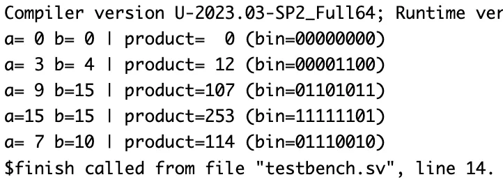

# 4x4 Array Multiplier – Verilog

## 🧠 Project Overview

This project implements a **4x4 Array Multiplier** using **Full Adders (FAs)** in Verilog.  
It performs binary multiplication of two 4-bit inputs (`a` and `b`) to produce an 8-bit product (`p`).  
The multiplier is built by **generating partial products** using AND gates and then **summing them** through a structured array of full adders.

---

## ✅ Key Features

- **Functionality**: Performs 4-bit × 4-bit binary multiplication.
- **Design Style**: Structural modeling using interconnected **Full Adders**.
- **Inputs**:
  - `a[3:0]` – 4-bit multiplicand
  - `b[3:0]` – 4-bit multiplier
- **Outputs**:
  - `p[7:0]` – 8-bit product result
- **Submodule Used**:
  - `fa.v` – Full Adder module (used in array architecture)

---

## 📂 Files Included

- `fa.v` – Verilog design of Full Adder  
- `array4x4multiplier.v` – Verilog design of 4x4 Array Multiplier  
- `array4x4multiplier_tb.v` – Testbench for the multiplier  
- `array4x4multiplier_waveform.png` – Screenshot of simulation waveform  
- `README.md` – Documentation for this module  

---

## ⚙️ How It Works

The array multiplier works in **three main stages**:

1. **Partial Product Generation**  
   - Each bit of `a` is ANDed with each bit of `b` to form 16 partial products.

2. **Summation Using Full Adders**  
   - The partial products are arranged in columns and added using **Full Adders (FA)** and **Half Adders** where necessary.

3. **Final Product Formation**  
   - The least significant bit (LSB) is the direct result of `a[0]*b[0]`.  
   - Higher-order bits are obtained through addition of carries and sums from previous stages.

Equation:  p = a × b

---

## 📊 Testbench Simulation Output

From `array4x4multiplier_tb.v`:

| a (decimal) | b (decimal) | Product (decimal) | Product (binary) |
|--------------|--------------|------------------|------------------|
| 0 | 0 | 0 | 00000000 |
| 3 | 4 | 12 | 00001100 |
| 9 | 15 | 135 | 10000111 |
| 15 | 15 | 225 | 11100001 |
| 7 | 10 | 70 | 01000110 |

---

## 🖼 Waveform

---

## 🛠 Tools Used

- **Verilog** – RTL design and hierarchical modeling  
- **Verdi** – Waveform visualization (`$fsdbDumpvars`)  
- **VCS** – Simulation  

---

> 💡 This project demonstrates the **structural construction of a 4x4 array multiplier** — a fundamental element in digital signal processing and arithmetic logic units (ALUs).  
It also illustrates how **combinational logic and hierarchical design** are applied to build scalable arithmetic circuits in VLSI.
