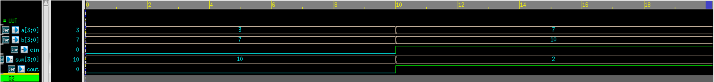

# 4-bit Carry Lookahead Adder (CLA) – Verilog

## 🧠 Project Overview
This project implements a **4-bit Carry Lookahead Adder (CLA)** in Verilog and verifies its functionality with a testbench. Unlike ripple-carry adders, the CLA reduces propagation delay by computing carry signals in parallel using **generate** and **propagate** logic. This design highlights an essential optimization technique in arithmetic logic used in modern ALUs.

## ✅ Key Features
- **Functionality**: Performs fast binary addition of two 4-bit numbers
- **Inputs**:
  - `A[3:0]` – 4-bit operand A
  - `B[3:0]` – 4-bit operand B
  - `Cin` – Carry input
- **Outputs**:
  - `Sum[3:0]` – 4-bit sum output
  - `Cout` – Final carry out
- **Design Style**: Structural / Gate-level implementation of CLA
- **Simulation**: Testbench applies different test vectors and observes waveforms

## 📂 Files Included
- `cla4.v` – Verilog source code of the 4-bit CLA
- `cla4_tb.v` – Testbench for the CLA
- `cla4_waveform.fsdb` – Simulation waveform file (Verdi format)
- `cla4_waveform.png` – Exported waveform screenshot
- `README.md` – Documentation for this module

## 🔗 Simulation
The CLA testbench checks:
1. Simple additions without carry
2. Additions with carry propagation
3. Cases where carry lookahead improves speed

---

## ⚙️ How the CLA Works
Carry Lookahead Logic:
Generate: Gi = Ai · Bi
Propagate: Pi = Ai ⊕ Bi

C1 = G0 + P0·Cin
C2 = G1 + P1·G0 + P1·P0·Cin
C3 = G2 + P2·G1 + P2·P1·G0 + P2·P1·P0·Cin
C4 = G3 + P3·G2 + P3·P2·G1 + P3·P2·P1·G0 + P3·P2·P1·P0·Cin

Sum is computed as:
Si = Pi ⊕ Ci

This parallel carry computation reduces the delay compared to ripple-carry adders.

---

## 📊 Test Bench Simulation Ouptut

| A    | B    | Cin | Sum   | Cout |
|------|------|-----|-------|------|
| 0011 | 0111 | 1   | 1011  | 0    |
| 0111 | 1010 | 0   | 0001  | 1    |

---

## 🖼 Waveform

---

## 🛠 Tools Used
- **Verilog** – CLA design and testbench
- **Verdi** – Waveform visualization (`fsdbDumpvars`)
- **Icarus Verilog / VCS / ModelSim** – For simulation

---

> 💡 This project demonstrates the advantage of **carry lookahead logic** in reducing addition delay, which is a critical building block in high-performance ALUs and processors.