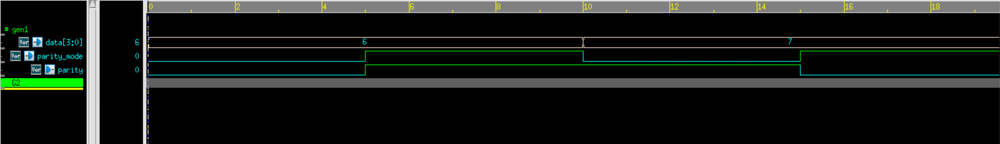

# 4-bit Parity Generator and Checker – Verilog

## 🧠 Project Overview

This project implements a **4-bit parity generator** and a **4-bit parity checker** in Verilog.  

- The **generator** creates even or odd parity for a 4-bit data word.
- The **checker** verifies the received data with the parity bit and flags an error if there is a mismatch.  

Both designs are tested with Verilog testbenches and observed via waveforms.

---

## ✅ Key Features

- **Parity Generator**:
  - Generates even (`parity_mode = 0`) or odd (`parity_mode = 1`) parity bit
- **Parity Checker**:
  - Compares received parity with calculated parity
  - Outputs `error = 1` if mismatch occurs
- **Inputs**:
  - `data[3:0]` – 4-bit data word
  - `parity_mode` – `0 = even parity`, `1 = odd parity`
  - `parity` – (checker) received parity bit
- **Outputs**:
  - `parity` (generator) – generated parity bit
  - `error` (checker) – high if mismatch is detected

---

## 📂 Files Included

- `4bitparitygen.v` – Verilog design for parity generator  
- `4bitparitygen_tb.v` – Testbench for parity generator  
- `4bitparitycheck.v` – Verilog design for parity checker  
- `4bitparitycheck_tb.v` – Testbench for parity checker  
- `4bitparity_waveform.png` – Simulation waveform screenshot  
- `README.md` – Documentation for this module  

---

## ⚙️ How It Works

### 🔹 Parity Generator

1. The generator XORs all four input data bits.  
   - If the result = `0`, data already has even parity.  
   - If the result = `1`, data has odd parity.  
2. Depending on `parity_mode`:
   - **Even mode (`0`)** → parity bit = XOR result  
   - **Odd mode (`1`)** → parity bit = inverted XOR result  

Formula:  
Even parity = D0 ⊕ D1 ⊕ D2 ⊕ D3
Odd parity  = ¬(D0 ⊕ D1 ⊕ D2 ⊕ D3)

---

### 🔹 Parity Checker

1. The checker recalculates expected parity from the data using the same XOR method.  
2. It compares the **received parity bit** with the **expected parity**.  
3. If both match → `error = 0` (no error).  
   If they differ → `error = 1` (error detected).  

Formula:  Expected parity = (D0 ⊕ D1 ⊕ D2 ⊕ D3) ⊕ parity_mode

Error = ReceivedParity ⊕ ExpectedParity

---

## 🔗 Simulation

### Generator Testbench Output

From `4bitparitygenerator_tb.v`:

| Data (`data`) | Mode (`parity_mode`) | Parity (Output) |
|---------------|-----------------------|-----------------|
| 0110          | 0 (even)             | 0 |
| 0110          | 1 (odd)              | 1 |
| 0111          | 0 (even)             | 1 |
| 0111          | 1 (odd)              | 0 |

---

### Checker Testbench Output

From `4bitparitycheck_tb.v`:

| Data (`data`) | Mode (`parity_mode`) | Received Parity (`parity`) | Error (Output) |
|---------------|-----------------------|----------------------------|----------------|
| 0110          | 0 (even)             | 0                          | 0 ✅ (Correct) |
| 0110          | 0 (even)             | 1                          | 1 ❌ (Error)   |
| 0110          | 1 (odd)              | 1                          | 0 ✅ (Correct) |
| 0110          | 1 (odd)              | 0                          | 1 ❌ (Error)   |

---

## 🖼 Waveform

**Parity Generator Gate level Waveform**

---

## 🛠 Tools Used

- **Verilog** – RTL design and testbenches  
- **Verdi** – Waveform visualization (`$fsdbDumpvars`)  
- **VCS** – Simulation  

---

> 💡 This project demonstrates **error detection using parity bits**, one of the simplest yet most widely used techniques in digital communication and VLSI systems.
