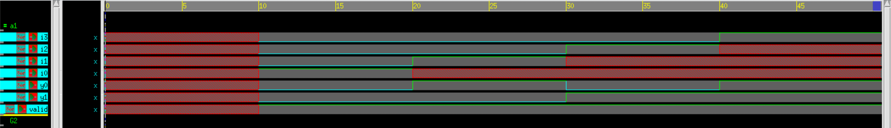
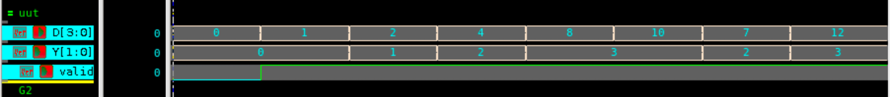

# 4-bit Priority Encoder – Verilog

## 🧠 Project Overview

This project implements a **4-bit priority encoder** in Verilog using gate-level modeling.  
A priority encoder outputs the binary representation of the **highest-priority active input**. If no input is active, the `valid` signal indicates that the output is invalid.  

The design is tested with a Verilog testbench and observed with waveform simulation.

---

## ✅ Key Features

- **Functionality**:
  - Encodes 4 input lines (`i3, i2, i1, i0`) into a 2-bit binary output (`y1, y0`)
  - Priority: `i3 > i2 > i1 > i0`
  - Provides a `valid` flag indicating if any input is active
- **Inputs**:
  - `i3, i2, i1, i0` – 4-bit input signals
- **Outputs**:
  - `y[1:0]` – Encoded 2-bit output
  - `valid` – High when one or more inputs are active
- **Design Style**: Gate-level modeling (using `or`, `nor`, `and`, `not`)

---

## 📂 Files Included

- `priorityencoder4bit.v` – Verilog source code of the 4-bit priority encoder  
- `priorityencoder4bit_tb.v` – Testbench for the priority encoder  
- `priorityencoder_waveform.png` – Screenshot of waveform  
- `README.md` – Documentation for this module  

---

## ⚙️ How It Works

1. The encoder checks the inputs from **highest priority (i3)** to **lowest (i0)**.  
2. The binary code for the highest active input is placed on outputs `y1 y0`.  
3. The `valid` signal is asserted high when any input is active.  
4. If all inputs are zero, the encoder output is `00` and `valid = 0`.  

Priority logic:
y1 = i3 + i2
y0 = i3 + (~i3·~i2·i1)
valid = i3 + i2 + i1 + i0

---

## 📊 Test Bench Simulation Output

From `priorityencoder4bit_tb.v`:

| i3 | i2 | i1 | i0 | y1 | y0 | valid |
|----|----|----|----|----|----|-------|
| 0  | 0  | 0  | 0  |  0 |  0 |   0   |
| 0  | 0  | 0  | 1  |  0 |  0 |   1   |
| 0  | 0  | 1  | x  |  0 |  1 |   1   |
| 0  | 1  | x  | x  |  1 |  0 |   1   |
| 1  | x  | x  | x  |  1 |  1 |   1   |

---

## 🖼 Waveform

---

## 🛠 Tools Used

- **Verilog** – RTL design and testbench  
- **Verdi** – Waveform visualization (`$fsdbDumpvars`)  
- **VCS** – Simulation  

---

> 💡 This project demonstrates a **priority encoder**, an essential circuit used in processors, interrupt controllers, and digital communication systems.
