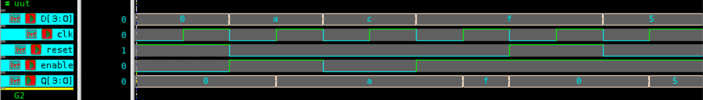

# 4-bit Register with Enable and Reset – Verilog

## 🧠 Project Overview

This project implements a **4-bit register** with **asynchronous reset** and **enable control** using behavioral Verilog.  
It demonstrates a basic sequential storage element where data is loaded, held, or cleared depending on control signals.

---

## ✅ Key Features

- **Asynchronous Reset (`reset`):** Clears the register immediately when high.  
- **Enable Control (`enable`):** Loads input data `D` into the register when high.  
- **Hold Operation:** When `enable = 0`, the output `Q` retains its previous value.  
- **Inputs:**
  - `D[3:0]` – 4-bit input data  
  - `clk` – Clock signal  
  - `reset` – Asynchronous reset signal  
  - `enable` – Load control signal  
- **Output:**
  - `Q[3:0]` – 4-bit register output  

---

## 📂 Files Included

- `register_4bit.v` – Verilog design for the 4-bit register  
- `register_4bit_tb.v` – Testbench for simulation  
- `register_waveform.png` – Simulation waveform screenshot  
- `README.md` – Documentation for this module  

---

## ⚙️ How It Works

1. **Reset High:** `Q` is cleared to `0000` immediately.  
2. **Enable High:** On every positive clock edge, `Q` loads the new value from `D`.  
3. **Enable Low:** The register holds its last stored value.  

This makes it suitable for **data storage**, **pipeline registers**, and **intermediate buffering** in sequential circuits.

---

## 📊 Testbench Simulation Output

From `tb_register_4bit.v`:

| Time (ns) | Reset | Enable | D (Input) | Q (Output) | Description |
|------------|--------|---------|------------|-------------|-------------|
| 0 | 1 | 0 | 0000 | 0000 | 🔁 Reset active, output cleared |
| 10 | 0 | 1 | 1010 | 1010 | ✅ Loaded new data into register |
| 20 | 0 | 0 | 1100 | 1010 | ⏸ Enable low, holding previous value |
| 30 | 0 | 1 | 1111 | 1111 | ✅ Loaded new data into register |
| 40 | 1 | 1 | 1111 | 0000 | 🔁 Reset triggered again |
| 50 | 0 | 1 | 0101 | 0101 | ✅ Loaded new data after reset |

---

## 🖼 Waveform

---

## 🛠 Tools Used

- **Verilog HDL** – RTL design and simulation  
- **Verdi** – Waveform visualization (`$fsdbDumpvars`)  
- **Icarus Verilog / ModelSim / VCS** – Testbench simulation  

---

> 💡 This design is a foundational **sequential circuit** component used widely in **microprocessors, counters, and digital pipelines**.  
> It illustrates the behavior of registers under **asynchronous reset** and **conditional data loading**.
