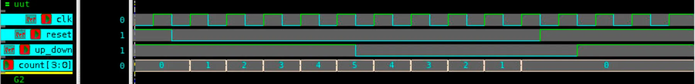

# 🧮 4-bit Synchronous Up/Down Counter – Verilog

## 🧠 Project Overview

This project implements a **4-bit Synchronous Up/Down Counter** using **behavioral modeling** in Verilog.  
It demonstrates how a counter can increment or decrement its value synchronously on the rising edge of the clock based on a control input signal `up_down`.

---

## ✅ Key Features

- **Synchronous Operation:** Counting occurs only on the positive edge of the clock.  
- **Up/Down Control (`up_down`):**
  - `1` → Counts upward (`0000 → 1111`)
  - `0` → Counts downward (`1111 → 0000`)
- **Asynchronous Reset (`reset`):** Immediately clears the counter to `0000`.
- **Inputs:**
  - `clk` – Clock signal
  - `reset` – Asynchronous reset
  - `up_down` – Direction control (`1 = up`, `0 = down`)
- **Output:**
  - `count[3:0]` – 4-bit counter output

---

## 📂 Files Included

- `synccounter.v` – Verilog design for the synchronous up/down counter  
- `synccounter_tb.v` – Testbench for functional verification  
- `sync_counter_waveform.png` – Simulation waveform output  
- `README.md` – Documentation file

---

## ⚙️ How It Works

1. When `reset = 1`, the counter resets to `0000`.  
2. When `reset = 0` and `up_down = 1`, the counter increments by 1 on each rising edge of `clk`.  
3. When `reset = 0` and `up_down = 0`, the counter decrements by 1 on each rising edge of `clk`.  
4. **Counting is modular (wrap-around):**
   - After reaching maximum (`1111`), it rolls over to `0000` in up mode.  
   - After reaching minimum (`0000`), it rolls over to `1111` in down mode.

---

## 📊 Testbench Simulation Output

**From `synccounter_tb.v`:**

| Time (ns) | Reset | Up/Down | Count (Output) | Description |
|------------|--------|----------|----------------|--------------|
| 0   | 1 | 1 | 0000 | 🔁 Reset active, counter cleared |
| 10  | 0 | 1 | 0001 | ✅ Counting up starts |
| 20  | 0 | 1 | 0010 | Counting up |
| 30  | 0 | 1 | 0011 | Counting up |
| 40  | 0 | 1 | 0100 | Counting up |
| 50  | 0 | 1 | 0101 | Counting up |
| 60  | 0 | 0 | 0100 | 🔄 Direction changed → Counting down |
| 70  | 0 | 0 | 0011 | Counting down |
| 80  | 0 | 0 | 0010 | Counting down |
| 90  | 0 | 0 | 0001 | Counting down |
| 100 | 1 | 0 | 0000 | 🔁 Reset triggered again |
| 110 | 0 | 1 | 0001 | ✅ Counting up after reset |
| 120 | 0 | 1 | 0010 | Counting up continues |
| 130 | 0 | 1 | 0011 | Counting up |

✅ The simulation verifies correct up and down counting behavior, as well as reset functionality.

---

## 🖼 Waveform

---

## 🛠 Tools Used

- **Verilog HDL** – RTL design and testbench  
- **Synopsys VCS** – Simulation tool  
- **Verdi** – Waveform visualization (`$fsdbDumpvars`)

---

## 💡 Summary

This **4-bit synchronous up/down counter** is a fundamental component in digital timing circuits, frequency dividers, and state machines.  
It illustrates the use of control logic for bidirectional counting and synchronous sequential behavior.
