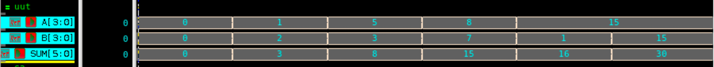

# 4-bit Adder (Behavioral Model) – Verilog

## 🧠 Project Overview

This project implements a **4-bit binary adder** using the **behavioral modeling approach** in Verilog.  
The adder performs binary addition of two 4-bit inputs (`A` and `B`) using the **`+` operator**, producing a 5-bit sum (`SUM`) that includes the carry-out bit.

---

## ✅ Key Features

- **Functionality**: Performs 4-bit binary addition (`A + B`)
- **Modeling Style**: Behavioral (using `+` operator)
- **Inputs**:
  - `A[3:0]` – 4-bit input operand
  - `B[3:0]` – 4-bit input operand
- **Output**:
  - `SUM[4:0]` – 5-bit sum (includes carry-out bit)

---

## 📂 Files Included

- `adder_4bit.v` – Verilog design of 4-bit adder  
- `adder_4bit_tb.v` – Testbench for 4-bit adder  
- `adder_4bit_waveform.fsdb` – Waveform dump file (Verdi)  
- `adder_4bit_waveform.png` – Screenshot of simulation waveform  
- `README.md` – Documentation for this module  

---

## ⚙️ How It Works

The design performs direct binary addition using Verilog’s arithmetic operator `+`.

Equation:SUM = A + B

The result (`SUM`) is 5 bits wide to accommodate carry overflow.

---

## 📊 Testbench Simulation Output

From `adder_4bit_tb.v`:

| A (4-bit) | B (4-bit) | SUM (5-bit) |
|------------|------------|-------------|
| 0000 | 0000 | 00000 |
| 0001 | 0010 | 00011 |
| 0101 | 0011 | 01000 |
| 1000 | 0111 | 11111 |
| 1111 | 0001 | 10000 |
| 1111 | 1111 | 11110 |

---

## 🖼 Waveform

**Adder Waveform**

---

## 🛠 Tools Used

- **Verilog** – RTL design and testbench  
- **Verdi** – Waveform visualization (`$fsdbDumpvars`)  
- **Icarus Verilog / VCS / ModelSim** – Simulation  

---

> 💡 This project demonstrates **behavioral-level modeling** of a simple 4-bit adder — an essential building block in arithmetic logic units (ALUs) and digital datapath circuits.
