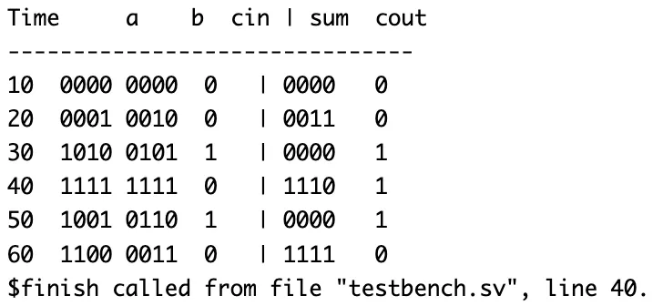
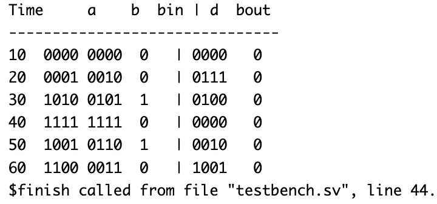
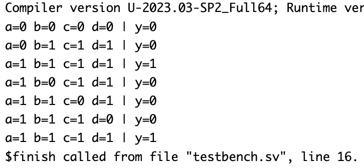
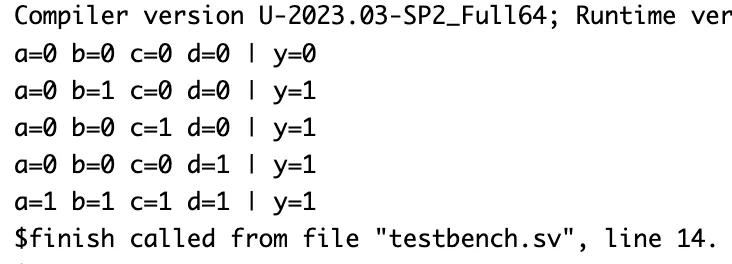
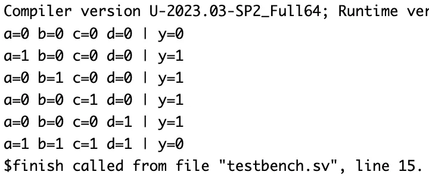
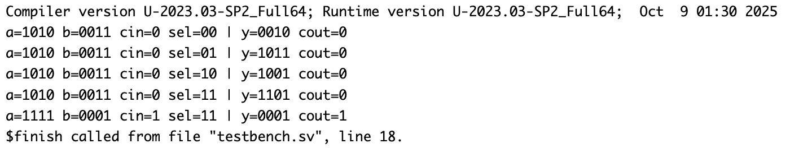

# 4-bit Arithmetic Logic Unit (ALU) – Verilog

## 🧠 Project Overview

This project implements a **4-bit Arithmetic Logic Unit (ALU)** in Verilog by integrating multiple submodules — **4-bit Full Adder**, **4-bit Full Subtractor**, **AND**, **OR**, and **XOR** gates.  
The ALU performs both **arithmetic** and **logic** operations based on the **2-bit control signal (`sel`)**, using **gate-level and structural modeling**.

Each submodule (Adder, Subtractor, AND, OR, XOR) was verified individually and then combined to form the complete ALU system.

---

## ✅ Key Features

- **Arithmetic Operations**
  - 4-bit Addition (`sel = 11`)
  - 4-bit Subtraction (using separate subtractor module)
- **Logic Operations**
  - AND (`sel = 00`)
  - OR (`sel = 01`)
  - XOR (`sel = 10`)
- **Inputs**
  - `a[3:0]` – First operand  
  - `b[3:0]` – Second operand  
  - `cin` – Carry-in (used in addition)
  - `sel[1:0]` – Operation select input
- **Outputs**
  - `y[3:0]` – 4-bit operation result  
  - `cout` – Carry-out for addition operation  

---

## 📂 Files Included

| Filename | Description |
|-----------|-------------|
| `fa.v` | 1-bit Full Adder (used as base unit) |
| `adder4.v` | 4-bit Full Adder using 1-bit adder instances |
| `fs.v` | 1-bit Full Subtractor |
| `subtractor4.v` | 4-bit Full Subtractor using 1-bit subtractor instances |
| `and4.v` | 4-input AND gate |
| `or4.v` | 4-input OR gate |
| `xor4.v` | 4-input XOR gate |
| `alu.v` | Main 4-bit ALU integrating all submodules |
| `alu_tb.v` | Testbench for ALU simulation |
| `README.md` | Documentation for this module |

---

## ⚙️ How It Works

### 🔸 Operation Control (via `sel[1:0]`)

| `sel[1:0]` | Operation | Description |
|-------------|------------|--------------|
| `00` | AND | Bitwise AND of A and B |
| `01` | OR  | Bitwise OR of A and B |
| `10` | XOR | Bitwise XOR of A and B |
| `11` | ADD | 4-bit addition using ripple-carry full adders |

### 🔸 Internal Connections

- Arithmetic logic is handled using `fa4bit` module.
- Logic functions are implemented using `and4`, `or4`, and `xor4` gates.
- The ALU selects output based on the control signal (`sel`) using combinational logic.

---

## 📊 Testbench Output

From `alu_tb.v` (simulated using **Synopsys VCS**):

| a (Input) | b (Input) | cin | sel | Operation | y (Output) | cout |
|------------|------------|------|------|-------------|------------|-------|
| 1010 | 0011 | 0 | 00 | AND | 0010 | 0 |
| 1010 | 0011 | 0 | 01 | OR | 1011 | 0 |
| 1010 | 0011 | 0 | 10 | XOR | 1001 | 0 |
| 1010 | 0011 | 0 | 11 | ADD | 1101 | 0 |
| 1111 | 0001 | 1 | 11 | ADD (Carry In = 1) | 0001 | 1 |

> ✅ Each operation is verified in simulation and matches the expected logic and arithmetic results.

---

## 🧩 Individual Module Behavior (from testbenches)

### **1-bit Full Adder (`fa.v`)**

| A | B | Cin | Sum | Cout |
|:-:|:-:|:-:|:-:|:-:|
| 1 | 0 | 0 | 1 | 0 |
| 1 | 0 | 1 | 0 | 1 |

---

### **4-bit Full Adder (`adder4.v`)**

| A | B | Cin | Sum | Cout |
|----|----|----|------|------|
| 0000 | 0000 | 0 | 0000 | 0 |
| 0001 | 0010 | 0 | 0011 | 0 |
| 1010 | 0101 | 1 | 0000 | 1 |
| 1111 | 1111 | 0 | 1110 | 1 |
| 1001 | 0110 | 1 | 1111 | 0 |
| 1100 | 0011 | 0 | 1111 | 0 |

#### 🖼 Output Waveform of 4-bit full adder

---

### **1-bit Full Subtractor (`fs.v`)**

| A | B | Bin | D | Bout |
|:-:|:-:|:-:|:-:|:-:|
| 0 | 0 | 0 | 0 | 0 |
| 0 | 0 | 1 | 1 | 1 |
| 0 | 1 | 0 | 1 | 1 |
| 0 | 1 | 1 | 0 | 1 |
| 1 | 0 | 0 | 1 | 0 |
| 1 | 0 | 1 | 0 | 0 |
| 1 | 1 | 0 | 0 | 0 |
| 1 | 1 | 1 | 1 | 1 |

---

### **4-bit Full Subtractor (`subtractor4.v`)**

| A | B | Bin | D | Bout |
|----|----|----|----|----|
| 0000 | 0000 | 0 | 0000 | 0 |
| 0001 | 0010 | 0 | 1111 | 1 |
| 1010 | 0101 | 1 | 0100 | 1 |
| 1111 | 1111 | 0 | 0000 | 0 |
| 1001 | 0110 | 1 | 0011 | 1 |
| 1100 | 0011 | 0 | 1001 | 0 |

#### 🖼 Output Waveform of 4-bit Full Subtractor

---

### **Logic Gates**

#### AND4

| Inputs (a,b,c,d) | Output (y) |
|------------------|-------------|
| 1,1,1,1 | 1 |
| 1,0,1,1 | 0 |

🖼 **Output Waveform:**

---

#### OR4

| Inputs (a,b,c,d) | Output (y) |
|------------------|-------------|
| 0,1,0,0 | 1 |
| 1,0,0,0 | 1 |

🖼 **Output Waveform:**

---

#### XOR4

| Inputs (a,b,c,d) | Output (y) |
|------------------|-------------|
| 1,1,1,1 | 0 |
| 0,1,0,1 | 0 |

🖼 **Output Waveform:**

---

### ⚙️ Complete ALU Simulation (`alu.v`)

| a | b | cin | sel | Operation | y | cout |
|----|----|----|----|------------|----|------|
| 1010 | 0011 | 0 | 00 | AND | 0010 | 0 |
| 1010 | 0011 | 0 | 01 | OR | 1011 | 0 |
| 1010 | 0011 | 0 | 10 | XOR | 1001 | 0 |
| 1010 | 0011 | 0 | 11 | ADD | 1101 | 0 |
| 1111 | 0001 | 1 | 11 | ADD (Carry In) | 0001 | 1 |

#### 🖼 Output Waveform of ALU

---

## 🛠 Tools Used

- **Verilog HDL** – RTL design and testbench development  
- **Synopsys VCS** – Simulation and output verification  
- **GTKWave / VCS DVE** – Waveform viewing (optional)

---

> 💡 The **4-bit ALU** serves as the foundation for **processor datapaths**, **embedded controllers**, and **VLSI arithmetic blocks**.  
> This modular design demonstrates **structural hierarchy**, **control-based operation selection**, and **gate-level hardware modeling**.

---
