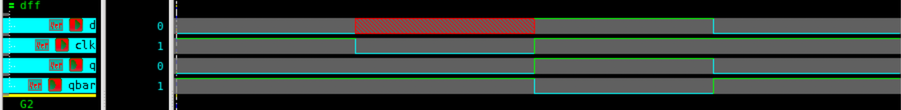
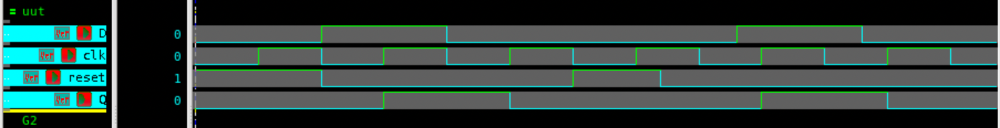

# D Flip-Flop – Verilog

## 🧠 Project Overview

This project implements a **D Flip-Flop** in Verilog using both **Behavioral** and **Gate-Level** modeling styles.
The D (Data/Delay) flip-flop is a clocked memory element that captures the value of the input `D` on the **rising edge** of the clock and stores it until the next clock edge.  
An additional **asynchronous reset** feature is provided to clear the stored value immediately when `reset = 1`, independent of the clock.

---

## ✅ Key Features

- **Functionality**:
  - `Q` follows `D` on the **rising edge** of `CLK`
  - **Asynchronous reset** clears output to `0`
  - Holds the stored value between clock events
- **Inputs**:
  - `D` – Data input  
  - `CLK` – Clock signal  
  - `RESET` – Asynchronous active-high reset
- **Outputs**:
  - `Q` – Stored value  
  - `Qn` – Complement of Q *(only in gate-level implementation)*

---

## 📂 Files Included

| Filename | Description |
|-----------|-------------|
| `dff.v` | D Flip-Flop Gate-Level Model |
| `dff_tb.v` | Testbench for Gate-Level D Flip-Flop |
| `dff_behav.v` | Behavioral D Flip-Flop with Asynchronous Reset |
| `dff_behav_tb.v` | Testbench for Behavioral Model |
| `dff_gatelevel.png` | Waveform of Gate-Level D Flip-Flop |
| `dff_behav.png` | Waveform of Behavioral D Flip-Flop |
| `README.md` | Documentation file |

---

## ⚙️ How It Works

1. On the **positive clock edge**, the flip-flop captures the input `D` and outputs it as `Q`.  
2. When **`RESET = 1`**, the output is immediately cleared to `0`, regardless of clock transitions.  
3. Between clock edges, `Q` retains its last value.  
4. In the gate-level version, `Qn` represents the inverted state of `Q`.

## 📊 Testbench Simulation Output (Gate Level Model)

| CLK | D | Q | Qn |
|-----|---|---|----|
| ↑   | 0 | 0 | 1 |
| ↑   | 1 | 1 | 0 |
| ↑   | 0 | 0 | 1 |
| ↑   | 1 | 1 | 0 |

---

### 🧪 Simulated Output (Behavioral Model)

| Time (ns) | Reset | CLK | D | Q | Description |
|------------|:------:|:---:|:---:|:---:|----------------------------------|
| 0  | 1 | 0 | 0 | 0 | Initial reset applied |
| 10 | 0 | ↑ | 1 | 1 | D captured on rising edge |
| 20 | 0 | ↑ | 0 | 0 | D = 0 captured |
| 27 | 1 | - | - | 0 | Asynchronous reset asserted |
| 33 | 0 | - | - | 0 | Reset released |
| 40 | 0 | ↑ | 1 | 1 | D = 1 captured on next edge |
| 50 | 0 | ↑ | 0 | 0 | D = 0 captured again |

> ✅ The behavioral D Flip-Flop correctly responds to both clock and asynchronous reset conditions.

---

## 🖼 Waveform

**D Flip-Flop Gate level Waveform**

**D Flip-Flop Behavioral Waveform**

---

## 🛠 Tools Used

- **Verilog** – RTL design and testbench  
- **Verdi** – Waveform visualization (`$fsdbDumpvars`)  
- **VCS** – Simulation  

---

> 💡 The **D flip-flop** is the foundation of registers, shift registers, and counters.
