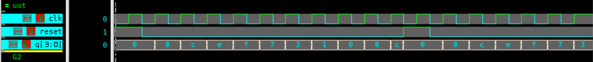

# 4-bit Johnson Counter – Verilog

## 🧠 Project Overview

This project implements a **4-bit Johnson Counter** (also known as a **Twisted Ring Counter**) using **behavioral modeling** in Verilog.  
Unlike the regular ring counter, the Johnson counter feeds the **inverted output of the last flip-flop** back to the **first flip-flop’s input**, producing **eight unique states** before repeating the sequence.

---

## ✅ Key Features

- **Type**: 4-bit Johnson (Twisted Ring) Counter  
- **Initialization**: Asynchronously reset to `0000`  
- **Operation**: On each positive clock edge, the **inverted LSB** is fed to the MSB, creating a continuous loop of unique patterns  
- **Inputs**:
  - `clk` – Clock signal  
  - `reset` – Asynchronous reset  
- **Outputs**:
  - `q[3:0]` – 4-bit Johnson counter output  

---

## 📂 Files Included

- `johnson_counter.v` – Verilog design file  
- `tb_johnson_counter.v` – Testbench file  
- `johnson_counter_waveform.png` – Simulation waveform screenshot  
- `README.md` – Documentation for this module  

---

## ⚙️ How It Works

1. On **reset**, the counter initializes to `0000`.  
2. On each **rising edge** of the clock, the **MSB** receives the **inverted LSB**.  
3. The remaining bits **shift right**, resulting in a cyclic sequence of **eight states**.  
4. After 8 clock cycles, the pattern repeats.  

**Johnson Counter Sequence (4-bit):**

| Cycle | Output (q) |
|:------:|:------------:|
| 0 | 0000 |
| 1 | 1000 |
| 2 | 1100 |
| 3 | 1110 |
| 4 | 1111 |
| 5 | 0111 |
| 6 | 0011 |
| 7 | 0001 |
| 8 | 0000 (repeats) |

---

## 📊 Testbench Simulation Output

From `tb_johnson_counter.v`:

| Time (ns) | Reset | Output (`q`) | Description |
|------------|--------|---------------|--------------|
| 0  | 1 | 0000 | 🔁 Reset active → Counter initialized |
| 10 | 0 | 1000 | Shift & invert feedback |
| 20 | 0 | 1100 | Continue Johnson sequence |
| 30 | 0 | 1110 | Shift right |
| 40 | 0 | 1111 | All bits high |
| 50 | 0 | 0111 | Start returning zeros |
| 60 | 0 | 0011 | Continue |
| 70 | 0 | 0001 | One last 1 remains |
| 80 | 0 | 0000 | Sequence repeats |
| 110 | 1 | 0000 | 🔁 Reset again |
| 120 | 0 | 1000 | Counter resumes |

---

## 🖼 Waveform

---

## 🛠 Tools Used

- **Verilog HDL** – RTL design and testbench development  
- **Verdi** – Waveform analysis (`$fsdbDumpvars`)  
- **VCS** – Simulation execution  

---

> 💡 The **Johnson Counter** is widely used in **digital timing applications**, **sequencers**, and **frequency dividers** due to its predictable and glitch-free output transitions.
