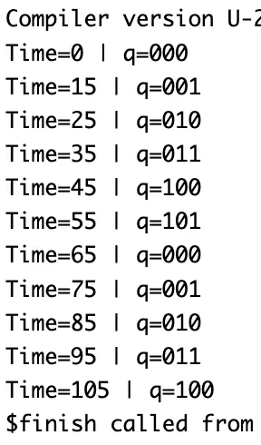

# MOD-6 Counter using T Flip-Flops – Verilog

## 🧠 Project Overview

This project implements a **MOD-6 (divide-by-6) counter** using **T Flip-Flops** in Verilog.  
The counter cycles through six unique states (`000` → `101`) and then resets back to `000`.  
It is a **synchronous counter**, where all flip-flops are triggered by the same clock edge.  

---

## ✅ Key Features

- **Functionality**: Counts from `000` to `101` (decimal 0–5) repeatedly.
- **Design Style**: Structural + Behavioral (TFF-based synchronous design)
- **Inputs**:
  - `clk` – Clock signal  
  - `reset` – Active-high reset  
- **Outputs**:
  - `q[2:0]` – 3-bit binary counter output  
- **Submodule Used**:
  - `tff.v` – T Flip-Flop module (toggles on `T=1`)

---

## 📂 Files Included

- `tff.v` – Verilog design for T Flip-Flop  
- `mod6counter.v` – Verilog design for MOD-6 Counter  
- `mod6_counter_tb.v` – Testbench for MOD-6 Counter  
- `mod6counter_waveform.fsdb` – Waveform dump file (Verdi)  
- `mod6counter_waveform.png` – Screenshot of simulation waveform  
- `README.md` – Documentation for this module  

---

## ⚙️ How It Works

The **T Flip-Flop (TFF)** toggles its output when `T=1` and holds the state when `T=0`.  

In this MOD-6 counter:

1. `T0` toggles every clock cycle → divides frequency by 2  
2. `T1` toggles when `q0` is HIGH  
3. `T2` toggles when both `q0` and `q1` are HIGH  
4. When the counter reaches `110` (decimal 6), it automatically resets to `000`  

Thus, the sequence of states is:  000 → 001 → 010 → 011 → 100 → 101 → 000 …

---

## 📊 Testbench Simulation Output

From `mod6_counter_tb.v`:

| Time (ns) | q[2:0] | Decimal | Description |
|------------|---------|----------|--------------|
| 0 | 000 | 0 | Counter reset |
| 10 | 001 | 1 | Increment |
| 20 | 010 | 2 | Increment |
| 30 | 011 | 3 | Increment |
| 40 | 100 | 4 | Increment |
| 50 | 101 | 5 | Increment |
| 60 | 000 | 0 | Reset after 6th count |
| 70 | 001 | 1 | Repeat sequence |
| 80 | 010 | 2 | Continue counting |
| 90 | 011 | 3 | Continue counting |
| 100 | 100 | 4 | Continue counting |
| 110 | 101 | 5 | Continue counting |

✅ After reaching **101 (decimal 5)**, the counter resets back to **000**, maintaining MOD-6 behavior.

---

## 🖼 Waveform

---

## 🛠 Tools Used

- **Verilog** – RTL and structural design  
- **Verdi** – Waveform visualization (`$fsdbDumpvars`)  
- **Icarus Verilog / VCS / ModelSim** – Simulation  

---

> 💡 This project demonstrates how a **synchronous MOD-N counter** can be built from **T Flip-Flops**.  
> MOD-6 counters are commonly used in **digital clocks, frequency dividers, and control logic circuits**.
