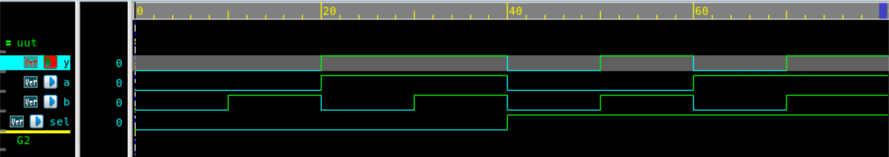

# 2x1 Multiplexer (MUX) – Verilog

## 🧠 Project Overview

This project implements a **2x1 Multiplexer (MUX)** using **three different modeling styles** in Verilog:

1. Behavioral modeling with `if-else`
2. Behavioral modeling with `case` statement
3. Gate-level modeling using basic logic gates  

A 2x1 MUX selects one of two inputs (`a` or `b`) based on a **select line (`sel`)** and routes it to the output `y`.

---

## ✅ Key Features

- Implements **three styles** of MUX design:
  - **If-Else** (Behavioral)
  - **Case** (Behavioral)
  - **Gate-Level** (Structural)
- **Inputs:**
  - `a`, `b` – Data inputs  
  - `sel` – Select signal  
- **Output:**
  - `y` – Selected output  

---

## 📂 Files Included

- `mux2x1_ifelse.v` – Design using `if-else`
- `mux2x1_ifelse_tb.v` – Testbench for `if-else` design  
- `mux2x1_case.v` – Design using `case` statement  
- `mux2x1_case_tb.v` – Testbench for `case` design  
- `mux2x1_gate.v` – Design using logic gates  
- `mux2x1_gate_tb.v` – Testbench for gate-level design  
- `mux2x1_waveform.png` – Simulation waveform screenshot  
- `README.md` – Documentation for this module  

---

## ⚙️ How a 2x1 MUX Works

A **2x1 multiplexer** passes one of the two input signals to the output based on the select line:

| `sel` | Output `y` |
|-------|-------------|
| 0     | `a`         |
| 1     | `b`         |

Essentially,  

y = (sel) ? b : a

---

## 🧩 Design 1: If-Else Modeling

### 📘 Design File: `mux2x1_ifelse.v`

Implements MUX behavior using `if-else` inside an `always` block.

### 🧪 Testbench Output

| SEL | A | B | Y |
|-----|---|---|---|
| 0 | 0 | 0 | 0 |
| 0 | 0 | 1 | 0 |
| 0 | 1 | 0 | 1 |
| 0 | 1 | 1 | 1 |
| 1 | 0 | 0 | 0 |
| 1 | 0 | 1 | 1 |
| 1 | 1 | 0 | 0 |
| 1 | 1 | 1 | 1 |

---

## 🧩 Design 2: Case Statement Modeling

### 📘 Design File: `mux2x1_case.v`

Implements MUX behavior using `case` selection.

### 🧪 Testbench Outputs

| SEL | A | B | Y |
|-----|---|---|---|
| 0 | 0 | 0 | 0 |
| 0 | 0 | 1 | 0 |
| 0 | 1 | 0 | 1 |
| 0 | 1 | 1 | 1 |
| 1 | 0 | 0 | 0 |
| 1 | 0 | 1 | 1 |
| 1 | 1 | 0 | 0 |
| 1 | 1 | 1 | 1 |

---

## 🧩 Design 3: Gate-Level Modeling

### 📘 Design File: `mux2x1_gate.v`

Implements MUX function using **basic logic gates (AND, OR, NOT)**:
y = (a & ~sel) | (b & sel)

### 🧪 Testbench's Output

| SEL | A | B | Y |
|-----|---|---|---|
| 0 | 0 | 0 | 0 |
| 0 | 0 | 1 | 0 |
| 0 | 1 | 0 | 1 |
| 0 | 1 | 1 | 1 |
| 1 | 0 | 0 | 0 |
| 1 | 0 | 1 | 1 |
| 1 | 1 | 0 | 0 |
| 1 | 1 | 1 | 1 |

---

## 🖼 Waveform

**2x1 MUX  Waveform**

---

## 🛠 Tools Used

- **Verilog** – RTL design and testbenches  
- **Verdi** – Waveform visualization (`$fsdbDumpvars`)  
- **Icarus Verilog / VCS / ModelSim** – Simulation  

---

> 💡 This project demonstrates how the same digital circuit can be implemented using **different abstraction levels** in Verilog — a key skill for mastering RTL design and verification in VLSI.
