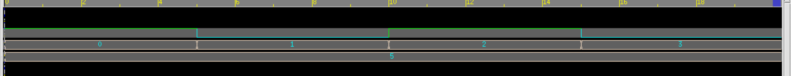
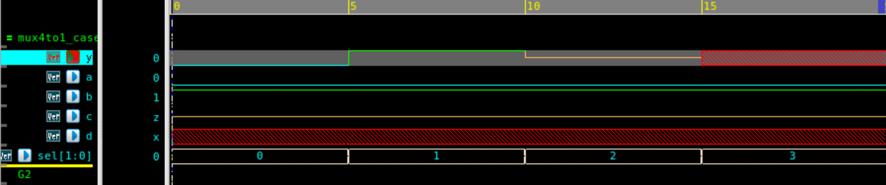

# 4x1 Multiplexer – Verilog

## 🧠 Project Overview

This project demonstrates the implementation of a **4-to-1 Multiplexer (MUX)** using Verilog in **gate-level modeling** and **behavioral modeling**. A multiplexer selects one of several input signals and forwards it to a single output line based on select inputs. The design is verified using a Verilog testbench and simulated with waveform generation.

## ✅ Key Features

- **Functionality**: Implements a 4x1 multiplexer
- **Inputs**:
  - `I[3:0]` – 4 data inputs
  - `S[1:0]` – 2-bit select input
- **Output**:
  - `OUT` – Selected data line
- **Design Style**: Gate-level modeling (`and`, `or`, `not`)
- **Simulation**:
  - Testbench applies different `S` values while `I` is fixed
  - Waveform observed using `$fsdbDumpvars` for Verdi

## 📂 Files Included

- `mux.v` – Verilog source code for 4x1 MUX in gate level
- `mux_tb.v` – Verilog testbench for the MUX in gate level
- `mux.4x1v` – Verilog source code for 4x1 MUX in behavioral
- `mux4x1_tb.v` – Verilog testbench for the MUX in behavioral
- `mux4x1_gatelevel.png` – Exported waveform screenshot (gate level)
- `mux4x1_behavioural.png` – Exported waveform screenshot (behavioral)
- `README.md` – Documentation for this module

## 🔗 Simulation

The testbench cycles through all select inputs:

- S = 00 → OUT = I[0]
- S = 01 → OUT = I[1]
- S = 10 → OUT = I[2]
- S = 11 → OUT = I[3]

---

## ⚙️ How the Multiplexer Works

The logic equation for a 4x1 multiplexer is:
OUT = (~S1 · ~S0 · I0) + (~S1 · S0 · I1) + (S1 · ~S0 · I2) + (S1 · S0 · I3)
This is implemented using `not`, `and`, and `or` gates in Verilog.

---

## 📊 Simulation Output (Gate level)

With `I = 1010`:

| Select Inputs (S1 S0) | Output (OUT) |
|------------------------|--------------|
| 00                     | 1 (I0)       |
| 01                     | 0 (I1)       |
| 10                     | 1 (I2)       |
| 11                     | 0 (I3)       |

---

### 🧪 Simulated Output (Behavioral Model)

| Time (ns) | a | b | c | d | sel[1:0] | y | Description |
|:----------:|:-:|:-:|:-:|:-:|:--------:|:-:|:-------------|
| 0 | 0 | 1 | Z | X | 00 | 0 | Selects input **a** (sel = 00) |
| 5 | 0 | 1 | Z | X | 01 | 1 | Selects input **b** (sel = 01) |
| 10 | 0 | 1 | Z | X | 10 | Z | Selects input **c** (sel = 10) |
| 15 | 0 | 1 | Z | X | 11 | X | Selects input **d** (sel = 11) |

> The **4x1 Multiplexer** correctly selects one of the four inputs (`a`, `b`, `c`, `d`) based on the 2-bit select line (`sel[1:0]`).
> Unknown (`X`) and high-impedance (`Z`) states are handled and displayed properly during simulation.

---

## 🖼 Waveform

**MUX Gate level Waveform**

**MUX Behavioural Waveform**

---

## 🛠 Tools Used

- **Verilog** – Design & testbench
- **Verdi** – Waveform visualization (`fsdbDumpvars`)
- **VCS** – For simulation

---

> 💡 This project is part of the Verilog portfolio, showcasing **gate-level digital design** and testbench-based verification, fundamental for VLSI design and hardware modeling.
