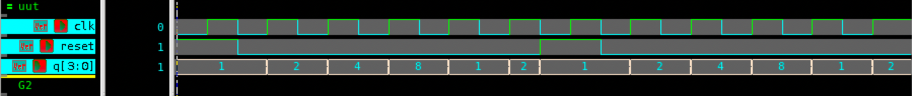

# 4-bit Ring Counter – Verilog

## 🧠 Project Overview

This project implements a **4-bit Ring Counter** using **behavioral modeling** in Verilog.  
A ring counter is a type of **shift register counter** in which the output of the last flip-flop is fed back to the input of the first, creating a **circular sequence** of bits.  
This design uses a **1-hot encoding** pattern where only one bit is high (`1`) at a time.

---

## ✅ Key Features

- **Type**: 4-bit ring counter (rotating left shift)
- **Initialization**: Automatically loads `0001` on reset  
- **Operation**: Shifts the ‘1’ bit left each clock cycle (circular shift)  
- **Inputs**:
  - `clk` – Clock signal  
  - `reset` – Asynchronous reset (sets counter to `0001`)  
- **Outputs**:
  - `q[3:0]` – 4-bit one-hot output sequence  

---

## 📂 Files Included

- `ring_counter.v` – Verilog design file  
- `tb_ring_counter.v` – Testbench file  
- `ring_counter_waveform.png` – Simulation waveform screenshot  
- `README.md` – Documentation for this module  

---

## ⚙️ How It Works

1. On **reset**, the counter initializes to `0001`.  
2. On each **positive clock edge**, the bits **rotate left**, with the MSB fed back to the LSB.  
3. This process repeats continuously, producing a **cyclic one-hot output**.  
4. The counter goes through 4 unique states before repeating.  

---

## 📊 Testbench Simulation Output

From `tb_ring_counter.v`:

| Time (ns) | Reset | Output (`q`) | Description |
|------------|--------|---------------|--------------|
| 0  | 1 | 0001 | 🔁 Reset active → Counter initialized |
| 10 | 0 | 0010 | Shift left |
| 20 | 0 | 0100 | Shift left |
| 30 | 0 | 1000 | Shift left |
| 40 | 0 | 0001 | Wrap-around rotation |
| 50 | 0 | 0010 | Continue rotation |
| 60 | 1 | 0001 | 🔁 Reset reactivated |
| 70 | 0 | 0010 | Shift left |
| 80 | 0 | 0100 | Shift left |
| 90 | 0 | 1000 | Shift left |
| 100 | 0 | 0001 | Rotation complete |

---

## 🖼 Waveform

---

## 🛠 Tools Used

- **Verilog HDL** – RTL design and testbench  
- **Verdi** – Waveform visualization (`$fsdbDumpvars`)  
- **VCS** – Simulation execution  

---

> 💡 The **ring counter** is widely used in digital systems requiring **sequential activation** of operations, such as **traffic light controllers**, **stepper motor control**, and **timing circuits**.
