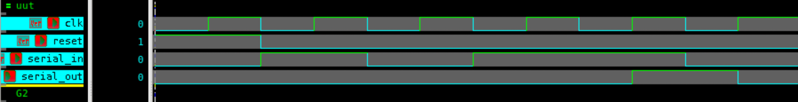

# 4-bit Serial-In Serial-Out (SISO) Shift Register – Verilog

## 🧠 Project Overview

This project implements a **4-bit Serial-In Serial-Out (SISO)** shift register using behavioral Verilog modeling.  
It demonstrates how serial data is shifted bit by bit through a register, with the **most significant bit (MSB)** being output after each clock cycle.

---

## ✅ Key Features

- **Shift Operation:** Shifts data left by one bit on every clock pulse.  
- **Serial Input (`serial_in`):** New bit enters the least significant position.  
- **Serial Output (`serial_out`):** Provides the bit shifted out (MSB).  
- **Asynchronous Reset (`reset`):** Clears all bits to zero immediately.  
- **Inputs:**
  - `clk` – Clock input  
  - `reset` – Asynchronous reset signal  
  - `serial_in` – Serial data input  
- **Output:**
  - `serial_out` – Serial output from MSB position  

---

## 📂 Files Included

- `shift_register_siso.v` – Verilog design file  
- `shift_register_siso_tb.v` – Testbench file  
- `siso_waveform.png` – Simulation waveform screenshot  
- `README.md` – Documentation for this module  

---

## ⚙️ How It Works

1. On each **positive edge of the clock**, the data in the register shifts **left by one bit**.  
2. The **`serial_in`** value enters at the least significant bit (LSB) position.  
3. The **`serial_out`** continuously outputs the MSB of the 4-bit register.  
4. When **`reset`** is asserted, all bits are cleared to `0`.  

This makes the circuit ideal for applications in **serial communication**, **data buffering**, and **bit-by-bit data transmission**.

---

## 📊 Testbench Simulation Output

From `tb_shift_register_siso.v`:

| Time (ns) | Reset | Serial In | Serial Out | Description |
|------------|--------|------------|-------------|--------------|
| 0  | 1 | 0 | 0 | 🔁 Reset active – register cleared |
| 10 | 0 | 1 | 0 | Input bit 1 shifted in |
| 20 | 0 | 0 | 0 | Input bit 0 shifted in |
| 30 | 0 | 1 | 0 | Input bit 1 shifted in |
| 40 | 0 | 1 | 1 | Input bit 1 shifted in, first output appears |
| 50 | 0 | 0 | 1 | Input bit 0 shifted in, next output |

---

## 🖼 Waveform

---

## 🛠 Tools Used

- **Verilog HDL** – RTL design and simulation  
- **Verdi** – Waveform visualization (`$fsdbDumpvars`)  
- **VCS** – Simulation environment  

---

> 💡 This project demonstrates the **serial data flow** mechanism used in **UARTs, SPI**, and other **sequential digital communication** systems, forming the basis for more complex shift register architectures.
