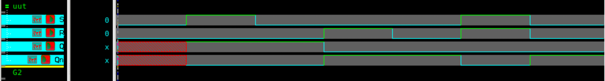

# SR Latch using NOR Gates – Verilog

## 🧠 Project Overview

This project implements a **Set-Reset (SR) Latch** using **NOR gates** in **gate-level modeling**.  
The SR latch is a **bistable circuit** used to **store one bit of information**, forming the foundation of flip-flops and memory elements.

---

## ✅ Key Features

- **Implemented using only NOR gates**
- **Bistable behavior** — two stable states: *Set* and *Reset*
- **Stores a single bit of information**
- **Gate-level modeling** shows hardware-level logic design

---

## ⚙️ Truth Table

| S | R | Q(next) | Qn(next) | Description |
|:-:|:-:|:--------:|:---------:|:-------------|
| 0 | 0 | No Change | No Change | Hold |
| 0 | 1 | 0 | 1 | Reset |
| 1 | 0 | 1 | 0 | Set |
| 1 | 1 | 0 | 0 | Invalid State |

---

## 📂 Files Included

| Filename | Description |
|-----------|-------------|
| `sr_atchnor.v` | SR latch design using NOR gates |
| `srlatchnor_tb.v` | Testbench for SR latch |
| `README.md` | Project documentation with simulation results |

---

## 🔧 How It Works

1. The circuit uses **two cross-coupled NOR gates**.  
2. When **S = 1**, the latch sets `Q = 1` and `Qn = 0`.  
3. When **R = 1**, it resets `Q = 0` and `Qn = 1`.  
4. When both `S = R = 0`, the latch holds its previous state.  
5. If **S = R = 1**, the state becomes invalid (both outputs go to 0).

---

## 🧪 Simulation Output

| Time (ns) | S | R | Q | Qn | Description |
|:----------:|:-:|:-:|:-:|:-:|:-------------|
| 0 | 0 | 0 | X | X | Initial undefined state |
| 5 | 1 | 0 | 1 | 0 | Set → Q = 1 |
| 10 | 0 | 0 | 1 | 0 | Hold (Q retains 1) |
| 15 | 0 | 1 | 0 | 1 | Reset → Q = 0 |
| 20 | 0 | 0 | 0 | 1 | Hold (Q retains 0) |
| 25 | 1 | 1 | 0 | 0 | Invalid state |
| 30 | 0 | 0 | 0 | 1 | Return to stable Hold |

> ✅ The SR Latch correctly demonstrates **Set**, **Reset**, and **Hold** functionality, with a clear **invalid condition** when both inputs are high.

---

## 🖼 Waveform

---

## 🛠 Tools Used

- **Verilog** – Design & Testbench  
- **Synopsys VCS** – Simulation  
- **Verdi** – Waveform analysis  

---

> 💡 *This SR Latch design is the building block for flip-flops and memory elements. It demonstrates the concept of feedback and bistable storage in sequential logic.*
