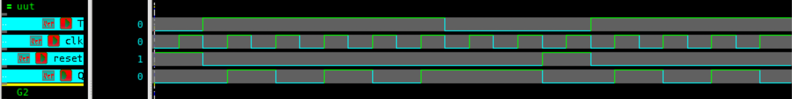

# T Flip-Flop – Verilog

## 🧠 Project Overview
This project implements a **T (Toggle) flip-flop** in Verilog.  
The T flip-flop toggles its output on every clock edge if `T=1`.  
If `T=0`, it retains its current state.

---

## ✅ Key Features
- **Functionality**:
  - T=0 → Hold state
  - T=1 → Toggle output
- **Inputs**:
  - `T` – Toggle control
  - `CLK` – Clock signal
- **Outputs**:
  - `Q` – Stored value
  - `Qn` – Complement of Q

---

## 📂 Files Included
- `tff.v` – Verilog design of T flip-flop  
- `tff_tb.v` – Testbench for T flip-flop  
- `tff_waveform.fsdb` – Waveform dump file  
- `tff_waveform.png` – Screenshot of simulation waveform  
- `README.md` – Documentation for this module  

---

## ⚙️ How It Works
1. The T flip-flop is derived from the JK flip-flop (by tying J=K=T).  
2. On every rising edge of the clock:
   - If T=1 → `Q` toggles.
   - If T=0 → `Q` holds.  
3. Often used in **counters**.  

---

## 📊 Testbench Simulation Output

| CLK | T | Q | Qn |
|-----|---|---|----|
| ↑   | 0 | Hold | Hold |
| ↑   | 1 | Toggle | Toggle |
| ↑   | 1 | Toggle | Toggle |
| ↑   | 0 | Hold | Hold |

---

## 🖼 Waveform

---

## 🛠 Tools Used
- **Verilog** – RTL design and testbench  
- **Verdi** – Waveform visualization (`$fsdbDumpvars`)  
- **VCS** – Simulation  

---

> 💡 The **T flip-flop** is the backbone of **binary counters** and frequency dividers.