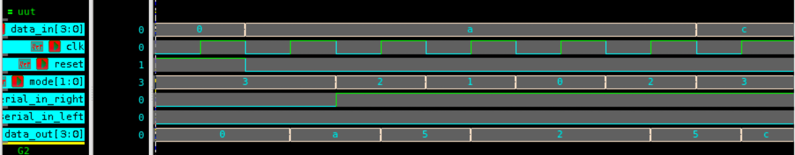

# 4-bit Universal Shift Register – Verilog

## 🧠 Project Overview

This project implements a **4-bit Universal Shift Register (USR)** using behavioral Verilog modeling.  
The register supports **four operating modes** — **Hold, Shift Right, Shift Left, and Parallel Load**, controlled by a 2-bit `mode` input.  
It serves as a fundamental component in **digital data processing** and **serial-to-parallel / parallel-to-serial** conversions.

---

## ✅ Key Features

- **4 Operating Modes:**
  - `00` → Hold current value  
  - `01` → Shift Right (MSB ← serial_in_left)  
  - `10` → Shift Left (LSB ← serial_in_right)  
  - `11` → Parallel Load (`data_out = data_in`)  
- **Asynchronous Reset:** Clears the register immediately.  
- **Inputs:**
  - `clk` – Clock signal  
  - `reset` – Asynchronous reset  
  - `mode[1:0]` – Selects operating mode  
  - `data_in[3:0]` – Parallel input data  
  - `serial_in_right` – Serial input for left shift  
  - `serial_in_left` – Serial input for right shift  
- **Output:**
  - `data_out[3:0]` – 4-bit register output  

---

## 📂 Files Included

- `universal_shift_register.v` – Verilog design file  
- `tb_universal_shift_register.v` – Testbench file  
- `usr_waveform.png` – Simulation waveform screenshot  
- `README.md` – Documentation for this module  

---

## ⚙️ How It Works

1. On each **positive clock edge**, the operation is determined by the 2-bit **`mode`** input.  
2. If **`reset`** is asserted, the register clears to `0000`.  
3. Depending on the **mode**, the register either:
   - Holds its state (`00`),  
   - Shifts right (`01`),  
   - Shifts left (`10`), or  
   - Loads data in parallel (`11`).  
4. **Serial inputs** (`serial_in_left`, `serial_in_right`) are used during shifting operations.  

---

## 📊 Testbench Simulation Output

From `tb_universal_shift_register.v`:

| Time (ns) | Mode | Reset | Serial L | Serial R | Data In | Data Out | Operation Description |
|------------|------|--------|-----------|-----------|----------|-----------|-----------------------|
| 0  | 11 | 1 | 0 | 0 | 0000 | 0000 | 🔁 Reset active – register cleared |
| 10 | 11 | 0 | 0 | 0 | 1010 | 1010 | Parallel load (data_in = 1010) |
| 20 | 10 | 0 | 0 | 1 | 1010 | 0101 | Shift Left (LSB ← 1) |
| 30 | 01 | 0 | 0 | 1 | 1010 | 0010 | Shift Right (MSB ← 0) |
| 40 | 00 | 0 | 0 | 1 | 1010 | 0010 | Hold – No change |
| 50 | 10 | 0 | 0 | 1 | 1010 | 0101 | Shift Left again |
| 60 | 11 | 0 | 0 | 1 | 1100 | 1100 | Parallel load new data |

---

## 🖼 Waveform

---

## 🛠 Tools Used

- **Verilog HDL** – Design and simulation  
- **Verdi** – Waveform analysis (`$fsdbDumpvars`)  
- **VCS** – Simulation execution  

---

> 💡 This project demonstrates how a single circuit can perform **multiple data transfer operations** — a crucial concept in **microprocessor design**, **ALU data routing**, and **digital communication systems**.
